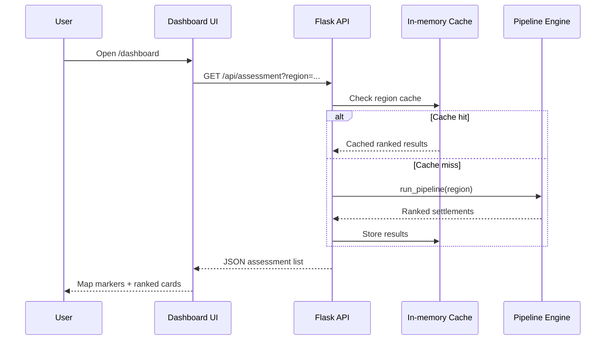
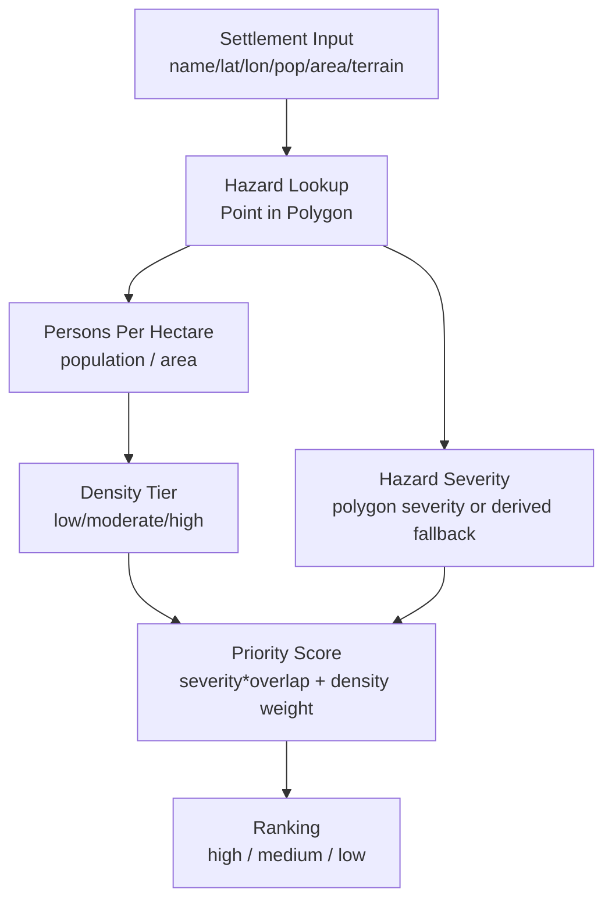

# SIH26191 — Disaster Management Decision-Support System

Intelligent identification of flood-hazard red zones, carrying-capacity stress, and relocation priority for vulnerable settlements.

> ⚠️ **Safety notice**: This repository is a **decision-support prototype**, not an operational emergency command system. Validate all outputs with certified authorities and verified ground data before field action.

---

## Quick Navigation Controls

Use these links to jump across sections quickly:

- [System Overview](#system-overview)
- [Interactive Architecture Charts](#interactive-architecture-charts)
- [Tech Stack](#tech-stack)
- [End-to-End Workflow](#end-to-end-workflow)
- [API Surface](#api-surface)
- [Frontend Navigation Map](#frontend-navigation-map)
- [Data Sources & Safety Guardrails](#data-sources--safety-guardrails)
- [Run Locally](#run-locally)
- [Repository Structure](#repository-structure)

---

## System Overview

This project combines:

1. **Hazard lookup** (polygon intersection against flood hazard zones)
2. **Exposure assessment** (whether settlement coordinates fall in hazard zone)
3. **Density/capacity classification** (URDPFI-derived persons-per-hectare tiers)
4. **Relocation priority scoring** (hazard severity + overcrowding)
5. **Interactive planner UI** (map, ranked list, and settlement detail)

It supports two dataset modes:

- **`majuli`** (pilot): smaller focused dataset for walkthroughs
- **`national`**: large real-data mode (53k+ villages) with startup pre-caching for fast responses

---

## Interactive Architecture Charts

### 1) High-Level System Architecture

```mermaid
flowchart LR
    U[Field Operator / Planner] --> FE[Frontend UI\nHTML/CSS/JS + Leaflet]
    FE -->|REST API| BE[Flask Backend]

    BE --> HZ[Hazard GeoJSON Loader]
    BE --> IDX[Shapely STRtree\nSpatial Index]
    BE --> PIPE[Assessment Pipeline]
    PIPE --> CAP[Capacity Classifier\nURDPFI tiers]
    PIPE --> PRI[Priority Engine\nScore + Rank]

    BE --> DATA[(Settlement & Hazard Data Files)]
    BE --> EXT[Nominatim Geocoding\n(OpenStreetMap)]

    FE <-->|Assessment, Hazard, Detail| BE
```

### 2) Request Flow (Assessment)



### 3) Decision Logic Flowchart



---

## Tech Stack

### Backend

- **Python 3**
- **Flask** (API + static page serving)
- **Shapely** (geometry operations + STRtree spatial index)
- **Requests** (external geocoding call)

### Frontend

- **Vanilla HTML/CSS/JavaScript**
- **Leaflet** (map rendering)
- **Leaflet.markercluster** (large marker performance)
- **Google Fonts + Material Symbols**

### Data & Processing

- GeoJSON hazard layers
- Settlement JSON datasets
- In-memory regional state and cached assessments for fast API responses

---

## End-to-End Workflow

1. User opens **Check My Village** or **Dashboard**.
2. Frontend requests hazard/assessment data from Flask API.
3. Backend resolves `region` and reads in-memory dataset.
4. Spatial hazard check runs against prebuilt STRtree index.
5. Density class is computed from persons-per-hectare.
6. Priority score is generated and ranked.
7. Frontend renders:
   - map markers
   - assessment cards
   - settlement detail view

---

## API Surface

### Region & Data
- `GET /api/regions` — list supported regions/datasets
- `GET /api/hazard?region=X` — region hazard GeoJSON
- `GET /api/settlements?region=X` — active settlement list

### Settlement Management
- `POST /api/settlements?region=X` — add settlement
- `DELETE /api/settlements/<name>?region=X` — remove settlement
- `POST /api/settlements/reset?region=X` — reset region dataset

### Assessment & Lookup
- `GET /api/assessment?region=X[&limit=N]` — full ranked list
- `GET /api/assessment-summary?region=X` — counts + top records
- `GET /api/settlement-detail?name=<name>&region=X` — single settlement detail
- `GET /api/village-check?q=<name>&region=X` — quick verdict lookup
- `GET /api/nearest-village?lat=<lat>&lon=<lon>&region=X` — nearest settlement verdict
- `GET /api/geocode?q=<place>` — place-name to coordinates (Nominatim)

---

## Frontend Navigation Map

### Page-Level Navigation

```mermaid
flowchart LR
    A[/] -->|Check result CTA| B[/dashboard]
    B --> C[/settlement/<name>]
    B --> D[/protocols]
    B --> E[/resources]
    C --> B
    C --> A
```

### Dashboard Internal Navigation Controls

- **Top-right region selector**: switches `majuli` ↔ `national`
- **Side nav + bottom nav**: tab switching and quick page jumps
- **Main tabs**:
  - `MAP`
  - `ASSESSMENT`
  - `ADD SETTLEMENT`
- **Reset button**: restore region defaults
- **Dismiss/reopen onboarding panel**: localStorage-backed UI control

---

## Data Sources & Safety Guardrails

### Data Characteristics

- Pilot region (`majuli`) uses small curated demo polygon flow for focused testing.
- National region uses large real-data records and historical flood-event context.
- Unmatched records are excluded instead of auto-estimated in national workflow.

### Guardrails (No Critical Info Leakage)

This repository intentionally avoids storing or requiring:

- API secrets/tokens for core functionality
- private credentials in source
- production incident command data
- personally identifiable evacuation records

`.env.example` is included only as a template and does not contain secrets.

---

## Run Locally

### Option A — Standard Python flow

```bash
python3 -m venv .venv
source .venv/bin/activate
pip install -r requirements.txt
python backend/server.py
```

### Option B — Startup helper script

```bash
./start.sh
```

Notes:

- `backend/server.py` defaults to `PORT=5001`
- `start.sh` defaults to `PORT=8080`
- You can override either with:

```bash
PORT=5000 python backend/server.py
```

---

## Repository Structure

```text
backend/server.py                  Flask API, routing, pipeline wiring, cache warmup
frontend/index.html               Check My Village entry screen
frontend/dashboard.html           Main planner dashboard
frontend/settlement.html          Settlement deep-dive page
frontend/protocols.html           Protocols/guidelines page
frontend/resources.html           Resource allocation page
frontend/app.js                   Dashboard interactivity + map/tabs/nav controls
frontend/style.css                Shared system styling
app/hazard/load_hazard_data.py    Hazard GeoJSON loading
app/capacity/thresholds.py        URDPFI-based density classification
app/relocation/priority_engine.py Priority scoring and ranking
data/                             Hazard and settlement source files
research/                         One-off data prep/support scripts
requirements.txt                  Python dependencies
start.sh                          Local startup wrapper
```

---

## Operational Limitations

- This is **not** an officially certified emergency decision engine.
- Hazard, relocation, and capacity results must be reviewed by domain authorities.
- Ground-truthing and legal/administrative validation are required before execution.

---

## License / Usage

Use according to the dataset source licenses and your organization’s deployment/compliance policies.
